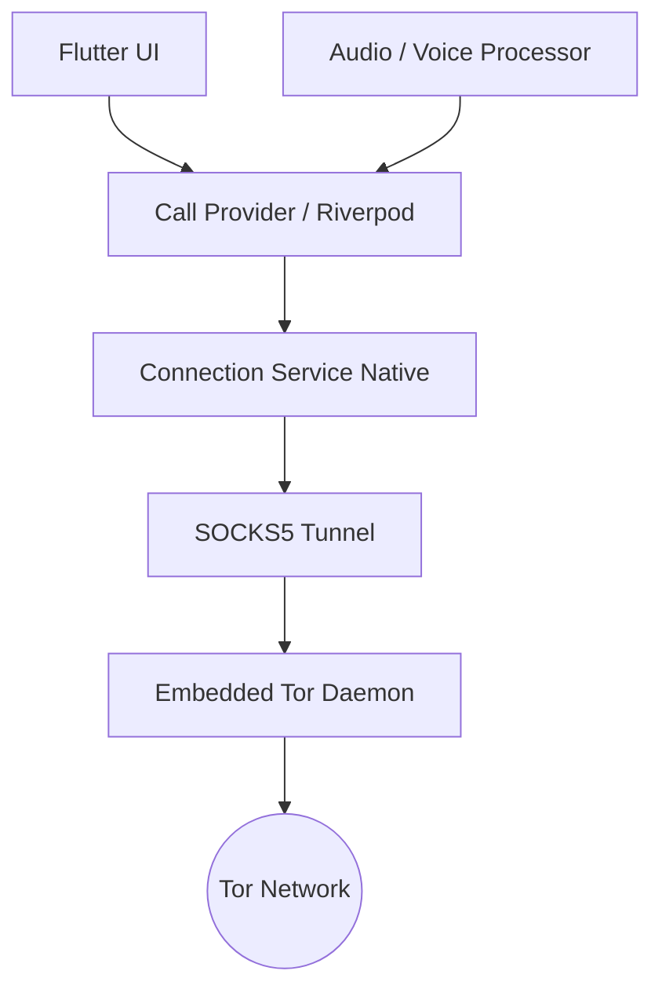
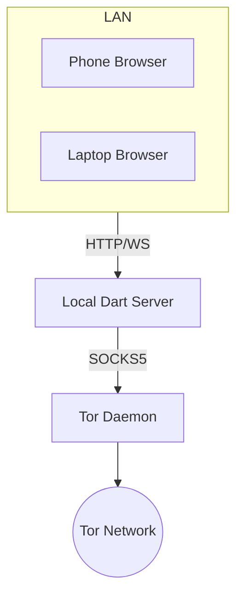
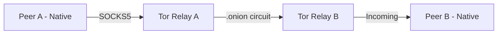
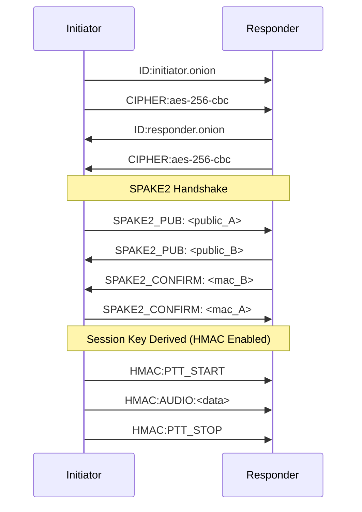

# 🧅 OnionTalkie

**Encrypted End-to-End Voice Communications over the Tor Network.**

**OnionTalkie** is a **Push-to-Talk (PTT)** voice communication platform designed for maximum privacy. It uses no central servers, no phone numbers, and no accounts. Each user is identified solely by their locally generated `.onion` address.

### Who is it for?

* **Journalists & activists** operating under censorship or surveillance regimes
* **Users in censored countries** where mainstream messaging apps are blocked (via Snowflake Bridge)
* **NGOs & human rights organizations** coordinating fieldwork in hostile environments
* **Lawyers & healthcare professionals** handling privileged or sensitive communications
* **Security researchers** studying anonymous communication protocols
* **Whistleblowers** who need untraceable voice channels with no account trail
* **Privacy enthusiasts** who refuse to trust centralized infrastructure with their metadata
* **Travelers & Digital Nomads** on limited data plans (e.g., international eSIMs) who can get **~57 hours of talk time per GB** (~18MB/hour).

---

## ✨ Key Features

* **No Central Infrastructure:** Direct peer-to-peer communication via *Tor Hidden Services*.
* **Zero Metadata:** No record of who talks to whom. Traffic is routed through three random Tor nodes.
* **State-of-the-Art Encryption:**
  * **PFS (Perfect Forward Secrecy):** Via **SPAKE2 (PAKE)** key exchange per RFC 9382.
  * **Multi-Cipher:** 21 cipher variants supported (AES, ChaCha20, Camellia, ARIA).
  * **HMAC-SHA256:** Message authentication with anti-replay nonce.
* **Anti-Censorship:** Native **Snowflake Bridge** integration to connect even where Tor is blocked.
* **Cross-Platform:** Native Android/iOS app and self-hosted Web version for LAN use.
* **Privacy-by-Design:** Built-in **Voice Processor** (voice changer) and instant Onion address rotation.
* **Circuit Visualization:** Real-time monitoring of Tor relay paths.

---

## 🛠️ Architecture

OnionTalkie turns your device into a Tor server.

### 📱 Native Mobile Architecture
The Tor binary is embedded directly in the app. The UI communicates with the local Tor daemon via a SOCKS5 proxy.



### 💻 Web / Relay Architecture
A local Dart server manages the SOCKS5 proxy, allowing any browser on your home network to join.



### 📡 Connection Flow (Native-to-Native)
Peers connect through the Tor network using SOCKS5 handshakes to establish a TCP-like stream over .onion addresses.



---

## 🚀 Quick Start

### 📱 Android

1. Download the latest APK from the [Releases](../../releases) page.
2. On first launch, the app will automatically configure your `.onion` address.
3. Share the QR Code with a friend and start talking.

### 🍎 iOS

1. Download the latest `.ipa` file from the [Releases](../../releases) page.
2. To install on non-jailbroken devices, we recommend using **[SideStore](https://docs.sidestore.io/docs/installation/prerequisites)**.
3. Follow the **[SideStore Installation Guide](https://docs.sidestore.io/docs/installation/prerequisites)** to set it up.
4. Once SideStore is ready, open the `.ipa` and install it.

### 💻 Web / Self-Hosted (Recommended for Desktop)

**Prerequisites:**

| Software | Installation |
|----------|-------------|
| **Flutter** >= 3.22.0 | [flutter.dev/get-started](https://flutter.dev/docs/get-started/install) |
| **Dart** >= 3.4.0 | Included with Flutter |
| **Tor** | macOS: `brew install tor` · Linux: `sudo apt install tor` · Windows: [torproject.org](https://www.torproject.org/download/) |

```bash
git clone https://github.com/g-cesar/OnionTalkie.git
cd OnionTalkie
chmod +x start.sh
./start.sh
```

---

## 🔒 Security & Encryption

### Key Exchange (PAKE)
OnionTalkie uses **SPAKE2** (RFC 9382 on P-256). You agree on a passphrase with your contact. The algorithm derives a robust session key without ever sending the password over the network.

### Cipher Selection
| Family | Variants | Notes |
|--------|----------|-------|
| **AES** | 128/192/256-bit | Industry standard |
| **ChaCha20** | ChaCha20-Poly1305, ChaCha20 | Optimized for mobile |
| **Camellia** | 128/192/256-bit | Japanese standard |
| **ARIA** | 128/192/256-bit | Korean standard |

---

## 📡 Protocol

OnionTalkie uses a line-based text protocol. Once a session key is derived, messages can be wrapped in **HMAC-SHA256**.

| Message | Description |
|---------|-------------|
| `ID:<onion>` | Local identity exchange |
| `CIPHER:<name>` | Cipher negotiation |
| `SPAKE2_PUB:<b64>` | PAKE public value exchange |
| `SPAKE2_CONFIRM:<hex>`| Key verification |
| `HMAC:<n>:<h>:<m>` | Authenticated message wrapper |
| `PTT_START/STOP` | Push-to-Talk signals |
| `AUDIO:<base64>` | Encrypted audio chunks (IMA ADPCM) |
| `MSG:<base64>` | Encrypted text chat |

### Handshake Sequence


---

## 📂 Project Structure

```
├── lib/
│   ├── core/           # Constants, router, theme
│   ├── providers/      # Riverpod state management (Call, Tor, Contacts)
│   ├── services/       # Platform logic (Audio, Encryption, SPAKE2, Tor)
│   ├── models/         # Data structures
│   └── screens/        # UI Layers
├── scripts/            # Build & Fetch scripts
├── server/             # Dart/Shelf Relay Server
└── README.md
```

---

## 🤝 Credits & Inspiration

* **[TerminalPhone](https://gitlab.com/here_forawhile/terminalphone):** Foundation for circuit management and PTT protocol.
* **[The Tor Project](https://www.torproject.org/):** Anonymity infrastructure.

---

## ⚖️ License

Distributed under the MIT License. See the `LICENSE` file for details.
